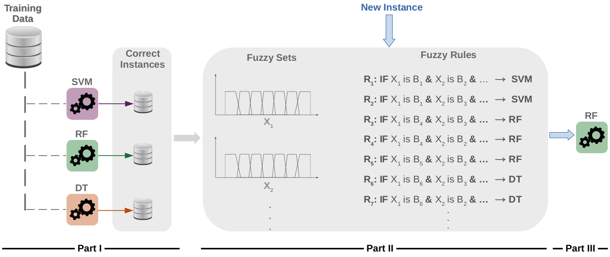

# eXplainable Fuzzy Ensemble (eXFE) - v1.0

### Thanks for your interest in using eXFE.


Supervised learning algorithms consider different learning biases from the universe of all admissible functions to induce classifiers. When using ensembles, one takes advantage of different biases typically built from the same algorithm to combine complementary classifiers into a single model, such as Random Forest, that builds up several trees from different attributes and examples.

eXFE innovates ensemble strategies by explaining and exploring distinct, restrict, and complementary biases from different algorithms. Multi-bias classifiers are combined using Fuzzy rules to execute symbolic reasoning and explain how each learning bias contributes to the final classification results. The following figure illustrates how eXFE works:



A detailed discussion about eXFE is found in the manuscript <a href="#" target="_blank">“eXplainable Ensemble Strategy using distinct and restrict learning biases: A Case Study on the Brazilian Forest”</a>, by Tatiane Rios, Ricardo Rios, and Rodrigo Mello (Applied Soft Computing, 2022).

The complete dataset was published on <a href="https://data.mendeley.com/datasets/9x62992sw6/2" target="_blank">Rios, R., Nogueira, T., Palma, G., and Mello, R., 2019. Brazilian forest dataset. DOI: 10.17632/9x62992sw6.2.</a>.

The organization of the material is:

> - **/dataset** - contains a reduced version of the Brazilian forest dataset.
> - **/src** - contains the eXFE source code.
> - **/results** - you can find some results and the pre-trained classification models in this folder.

In results, users will find several pretrained models specifically adjusted on our data. Those models were useful to confirm our hypothesis; however, new models and algorithms can be used by considering the users' goals.

Examples using traditional ensembles (XGBoost and Stacking) can be found at: "/src/notebooks/".

An example of our results can be found by running the following source code:

```Prolog
Rscript src/run-experiments.R
```
You can also open R and run:

```Prolog
source("src/run-experiments.R")
```

To see the produced output, just type:

```Prolog
output
```

In this code, the prediction ensemble was created combining three classifers to illustrate our contribution. Users can modify it to better address their applications.

If you find any issues with the code, please contact us: ricardoar@ufba.br.

On the behalf of all of the authors, we appreciate your interest in eXFE and hope it is useful to your research.

Please cite the following manuscripts:

> - Rios, T. N., Rios, R. A., & De Mello, R. F. (2022). eXplainable Ensemble Strategy using distinct and restrict learning biases: A Case Study on the Brazilian Forest. Applied Soft Computing.

> - Rios, R. A., Rios, T. N., Palma, G. R., & De Mello, R. F. (2021). Brazilian Forest Dataset: A new dataset to model local biodiversity. Journal of Experimental & Theoretical Artificial Intelligence, 34(2), 327-354.


